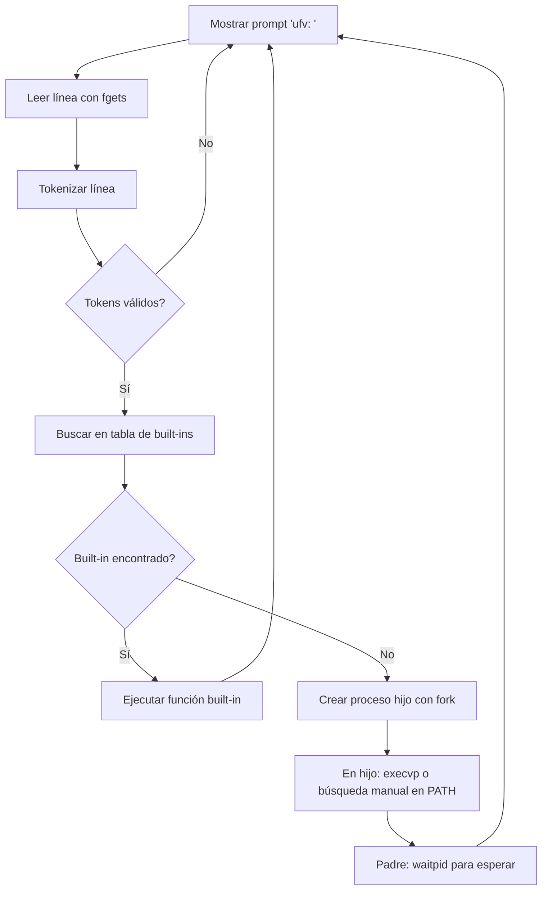

# Defensa del Proyecto: Mini-Shell UFV

**Estudiantes:** Ingenieros de 5  
**Fecha:** 17 de marzo de 2026  
**Asignatura:** Sistemas Operativos II  
**Proyecto:** Implementación de una Mini-Shell en C  

---

## 1. Introducción y Objetivos

### 1.1 Contexto
Una shell es básicamente una interfaz de línea de comandos que deja a los usuarios interactuar con el sistema operativo. Da acceso a cosas como manejar archivos, procesos y ejecutar programas. Este proyecto hace una mini-shell llamada "ufv_shell" que muestra conceptos clave de sistemas operativos en un entorno tipo UNIX (funciona en Linux, macOS y Windows con MSYS2).

### 1.2 Objetivos del Proyecto
- Hacer un shell interactivo (REPL: Read-Eval-Print Loop).
- Soporte para comandos built-in: `exit`, `pwd`, `cd`.
- Ejecutar programas externos manejando procesos (`fork`/`exec`).
- Resolver rutas automáticamente con la variable `PATH`.
- Tokenizar la entrada de forma robusta, manejando espacios, comillas y escapes.
- Manejar memoria y errores bien para evitar crashes.

### 1.3 Alcance
El proyecto usa el estándar POSIX y APIs de C como `fork`, `execvp`, `waitpid`, `getcwd`, `chdir`. No incluye cosas avanzadas como tuberías, redirección o jobs en background, nos enfocamos en lo básico.

---

## 2. Arquitectura y Estructura del Código

### 2.1 Componentes Principales
- **`ufv_shell_skeleton.c`**: Tiene la lógica principal del shell.
- **`tokenizer.c` y `tokenizer.h`**: Módulo para tokenizar la entrada del usuario.
- **Archivos de configuración**: `tasks.json` para compilar en VS Code.

### 2.2 Flujo de Ejecución General
El shell funciona en un bucle infinito:



Este diagrama muestra cómo fluye el programa: lee, procesa, ejecuta y repite.

### 2.3 Estructura de Datos Clave
- **`struct tokens`**: Representa la lista de tokens parseados.
- **`cmd_table[]`**: Array de estructuras `fun_desc_t` que asocia nombres de comandos con funciones.

```c
typedef struct fun_desc {
  cmd_fun_t *fun;
  char *cmd;
  char *doc;
} fun_desc_t;

fun_desc_t cmd_table[] = {
  {cmd_exit, "exit", "exit the command shell"},
  {cmd_pwd,  "pwd",  "print current working directory"},
  {cmd_cd,   "cd",   "change current working directory"},
};
```

---

## 3. Implementación de Comandos Built-in

### 3.1 Comando `exit`
**Propósito**: Terminar la ejecución del shell.

**Implementación**:
```c
int cmd_exit(struct tokens *tokens) {
  exit(0);
}
```

**Razones para ser built-in**:
- Debe afectar al proceso padre (la shell). Si se ejecutara en un hijo, solo terminaría el hijo, dejando la shell corriendo.

**Ejemplo de uso**:
```
ufv: exit
[Shell termina]
```

### 3.2 Comando `pwd` (Print Working Directory)
**Propósito**: Mostrar el directorio de trabajo actual.

**Implementación**:
```c
int cmd_pwd(struct tokens *tokens) {
  char cwd[4096];
  if (getcwd(cwd, sizeof(cwd)) != NULL) {
    printf("%s\n", cwd);
  } else {
    perror("pwd");
  }
  return 0;
}
```

**Razones para ser built-in**:
- Similar a `cd`, los cambios deben persistir en el proceso padre.

**Ejemplo de uso**:
```
ufv: pwd
/Users/brad/Desktop/SI2/Trabajo-Sistemas-2
ufv:
```

### 3.3 Comando `cd` (Change Directory)
**Propósito**: Cambiar el directorio de trabajo actual.

**Implementación**:
```c
int cmd_cd(struct tokens *tokens) {
  if (tokens_get_length(tokens) < 2) {
    char *home = getenv("HOME");
    if (home == NULL) {
      fprintf(stderr, "cd: HOME not set\n");
      return -1;
    }
    chdir(home);
  } else {
    char *path = tokens_get_token(tokens, 1);
    if (chdir(path) != 0) {
      perror("cd");
    }
  }
  return 0;
}
```

**Razones para ser built-in**:
- El cambio de directorio debe afectar al shell padre, no a un proceso hijo.

**Ejemplos de uso**:
```
ufv: cd ..
ufv: pwd
/Users/brad/Desktop/SI2
ufv: cd /tmp
ufv: pwd
/tmp
ufv: cd
ufv: pwd
/Users/brad
```

---

## 4. Ejecución de Programas Externos

### 4.1 Mecanismo de Ejecución
Cuando el comando no es built-in, se ejecuta como programa externo:

```mermaid
graph TD
    A[Comando no built-in] --> B[fork() crea proceso hijo]
    B --> C{Hijo}
    C --> D[execvp(prog, args) - busca en PATH]
    D --> E{Éxito?}
    E -->|Sí| F[Programa ejecuta]
    E -->|No| G[run_program_thru_path() - búsqueda manual]
    G --> H{Encontrado?}
    H -->|Sí| F
    H -->|No| I[fprintf(stderr, "command not found")]
    I --> J[exit(1)]
    F --> K[exit() implícito al terminar programa]
    B --> L{Padre}
    L --> M[waitpid(pid, &status, 0)]
    M --> N[Retornar status]
```

### 4.2 Implementación Detallada
```c
int run_program(struct tokens *tokens) {
  // Crear args array
  char **args = malloc(...);
  // ...
  pid_t pid = fork();
  if (pid == 0) {  // Hijo
    execvp(prog, args);
    run_program_thru_path(prog, args);  // Fallback
    fprintf(stderr, "ufv: %s: command not found\n", prog);
    exit(1);
  } else {  // Padre
    waitpid(pid, &status, 0);
  }
  free(args);
  return status;
}
```

### 4.3 Resolución de PATH
- **`execvp`**: Función de la familia `exec` que automáticamente busca en `PATH`.
- **Fallback manual**: `run_program_thru_path` usa `strtok_r` para dividir `PATH` y probar cada directorio.

### 4.4 Ejemplos de Ejecución Externa
**Comando encontrado en PATH**:
```
ufv: ls -la
total 16
drwxr-xr-x  5 brad staff  160 Mar 17 10:00 .
drwxr-xr-x  3 brad staff   96 Mar 17 09:00 ..
-rw-r--r--  1 brad staff  512 Mar 17 10:00 README.md
...
```

**Con path absoluto**:
```
ufv: /bin/echo "Hola Mundo"
Hola Mundo
```

**Comando no encontrado**:
```
ufv: nonexistent
ufv: nonexistent: command not found
```

---

## 5. Tokenización y Parsing de Entrada

### 5.1 Funcionalidades
- **Espacios**: Separan tokens.
- **Comillas simples (`'`)**: Preservan espacios y caracteres especiales dentro.
- **Comillas dobles (`"`)**: Similar, pero permiten expansión de variables (no implementado).
- **Escapes (`\`)**: Permiten caracteres literales.

### 5.2 Implementación
El tokenizador maneja tres modos: NORMAL, SQUOTE, DQUOTE.

```c
// Ejemplo de parsing
"echo 'hola mundo'" → ["echo", "hola mundo"]
"ls -la /tmp" → ["ls", "-la", "/tmp"]
"echo \"Hola \$USER\"" → ["echo", "Hola $USER"] (si expansión)
```

### 5.3 Manejo de Errores
- Líneas vacías o nulas: Ignoradas sin crash.
- Memoria: `tokens_destroy` libera todos los tokens y buffers.

---

## 6. Gestión de Memoria y Errores

### 6.1 Gestión de Memoria
- **Tokens**: `malloc` para estructuras, `free` en `tokens_destroy`.
- **Args en ejecución externa**: `malloc` y `free` en padre e hijo.
- **Prevención de leaks**: Todos los flujos liberan memoria.

### 6.2 Manejo de Errores
- **`perror`**: Para errores de sistema (`fork`, `malloc`, `chdir`).
- **Códigos de retorno**: Propagados desde hijos.
- **Validaciones**: `tokens == NULL`, longitudes inválidas.

### 6.3 Robustez
- **Input malformado**: No causa segmentation faults.
- **Procesos zombies**: `waitpid` previene zombies.
- **PATH faltante**: Fallback manual maneja casos edge.

---

## 7. Compilación y Ejecución

### 7.1 Compilación
```bash
clang -Wall -Wextra -std=c99 -o MiniShell/ufv_shell MiniShell/ufv_shell_skeleton.c MiniShell/tokenizer.c
```

### 7.2 Ejecución
```bash
./MiniShell/ufv_shell
ufv: pwd
/Users/brad/Desktop/SI2/Trabajo-Sistemas-2
ufv: exit
```

### 7.3 Compatibilidad
- **macOS**: APIs POSIX nativas.
- **Linux**: Compatible.
- **Windows**: Via MSYS2/MinGW.

---

## 8. Aprendizajes y Conclusiones

### 8.1 Conceptos Aprendidos
- **Gestión de procesos**: `fork`/`exec`/`wait` para multitarea.
- **Sistemas de archivos**: `getcwd`/`chdir` para navegación.
- **Variables de entorno**: Uso de `PATH` para resolución de comandos.
- **Programación defensiva en C**: Manejo de memoria, errores y validaciones.

### 8.2 Diferencias con Shells Reales
- **Bash/Zsh**: Soporte para tuberías (`|`), redirección (`>`), variables, scripting.
- **Nuestra implementación**: Nos enfocamos en lo básico, sin features avanzadas.

### 8.3 Mejoras Futuras
- Tuberías con `pipe`.
- Redirección de I/O.
- Jobs en background (`&`).
- Historial y autocompletado.

Este proyecto muestra que entendemos bien los sistemas operativos y C, haciendo un shell que funciona desde cero.

---

**Fin de la Defensa**